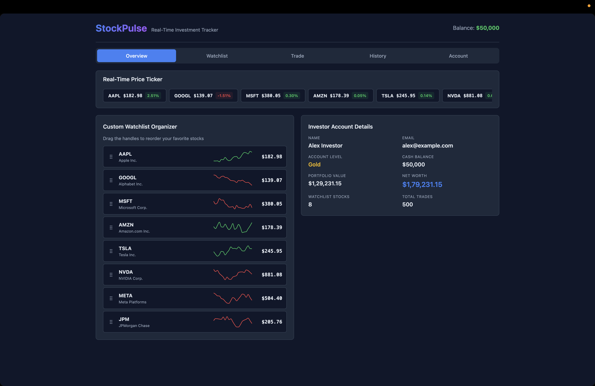
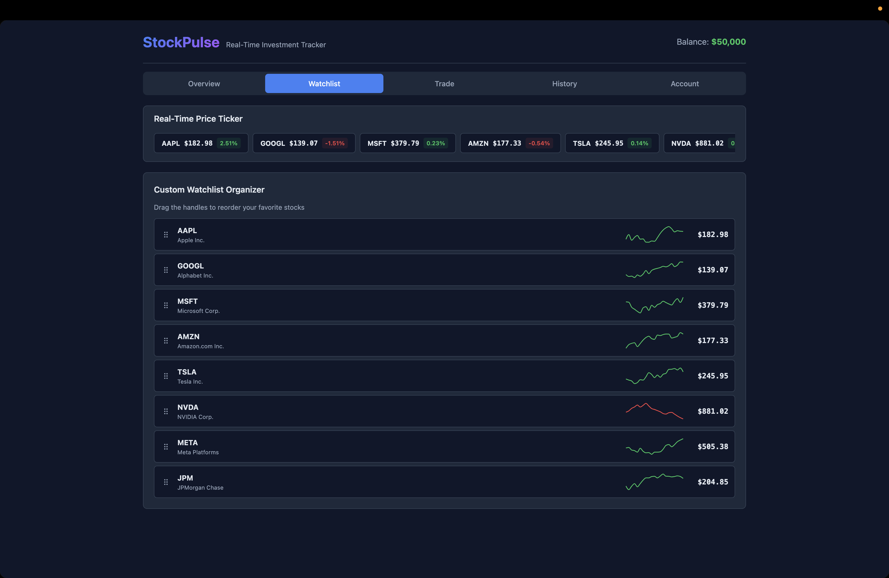
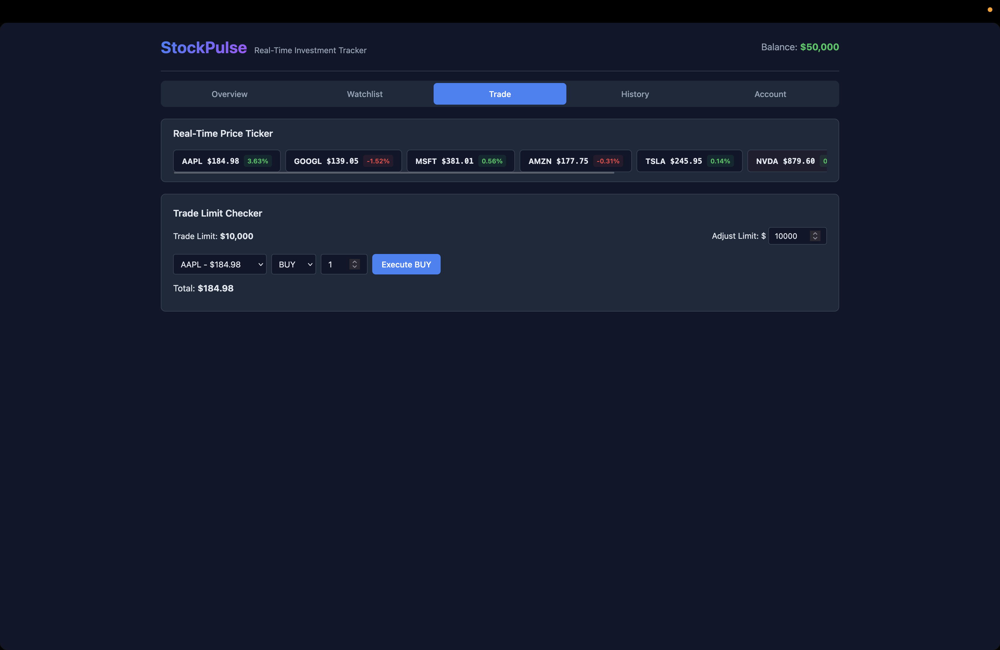
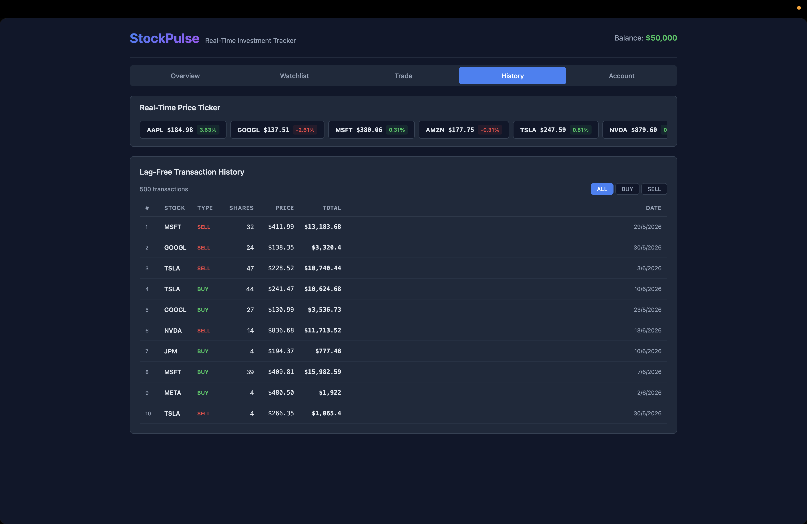
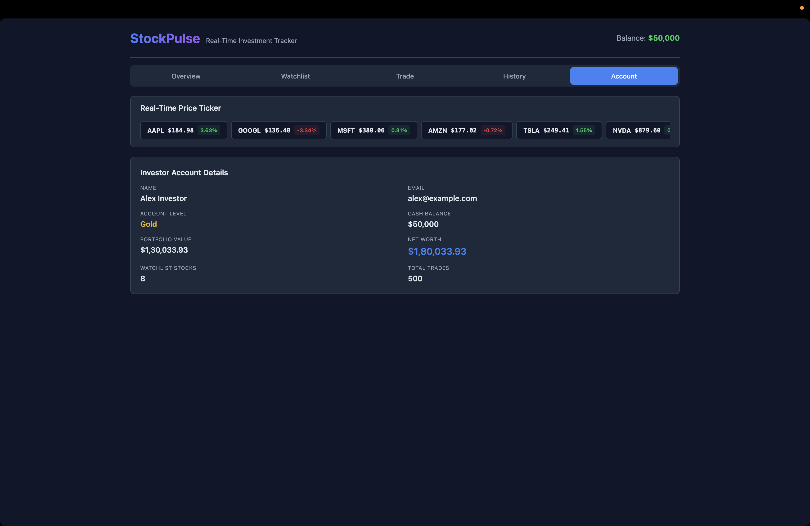

# StockPulse - React Case Study

A real-time investment tracking dashboard built with React 19, demonstrating modern React patterns and performance optimization techniques.

## Features

- **Real-Time Price Ticker** — Simulated live stock price updates every 800ms with price flash animations (green/red)
- **Custom Watchlist Organizer** — Drag-and-drop reordering of favorite stocks with mini price sparkline charts
- **Trade Limit Checker** — Execute buy/sell trades with configurable trade limits and balance validation
- **Lag-Free Transaction History** — Virtualized scrolling for smooth rendering of 1000+ transaction records
- **Investor Account Details** — Portfolio valuation, net worth calculation, and account profile display
- **Calculation Safety Net** — Error boundary that gracefully catches and reports rendering errors in financial calculations

## Performance Optimizations

- `React.memo` — Transaction rows skip re-renders when props haven't changed
- `useMemo` — Memoized portfolio calculations, filtered transactions, and chart data generation
- `useCallback` — Stable scroll handler reference prevents unnecessary effect re-runs
- `SmartWrapper` — Targeted re-render isolation for ticker items prevents cascading updates
- Virtual scrolling — Only visible transaction rows are rendered (buffer of 5 on each side)
- `ResizeObserver` — Dynamic container height measurement adapts to layout changes

## Tech Stack

- **React 19** — Hooks (`useState`, `useEffect`, `useMemo`, `useCallback`, `useRef`)
- **@dnd-kit** — Drag-and-drop watchlist reordering
- **Recharts** — Mini sparkline price charts
- **Vite** — Fast development server and build tool

## Getting Started

```bash
cd stockpulse
npm install
npm run dev
```

Open [http://localhost:5173](http://localhost:5173) in your browser.

### Production Build

```bash
npm run build
npm run preview
```

Open [http://localhost:4173](http://localhost:4173) to preview the production build.

## Screenshots

### Overview Tab


### Watchlist Tab


### Trade Tab


### History Tab


### Account Tab

